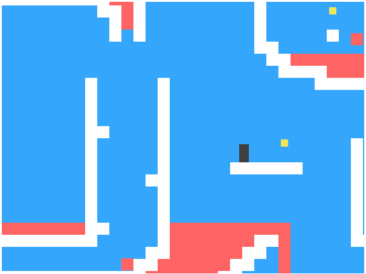
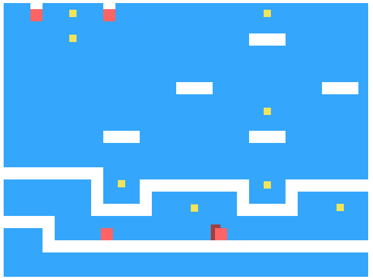

# JavaScript game
##### An attempt at replicating [Dark Blue](www.lessmilk.com/games/10) a side scrolling in browser game which uses JS, HTML, CSS to accomplish basic player function. Built with direciton and theory from Eloquent Javascript by Marijn Haverbeke.

### To Play:

```sh
$ git clone [git-repo-url]
$ cd /js_game
$ open index.html
```
### Game Control:
##### ^ (arrow) Jump
##### < (arrow) move left
##### > (arrow) move right

### Game Play:
##### collect all the coins to move to the next level


##### avoid the moving lava


# TO DO:

- build out more levels [currently using Marijn's levels]
- encapsulate level and player attributes in seperate files
- style home page to be more appealing
